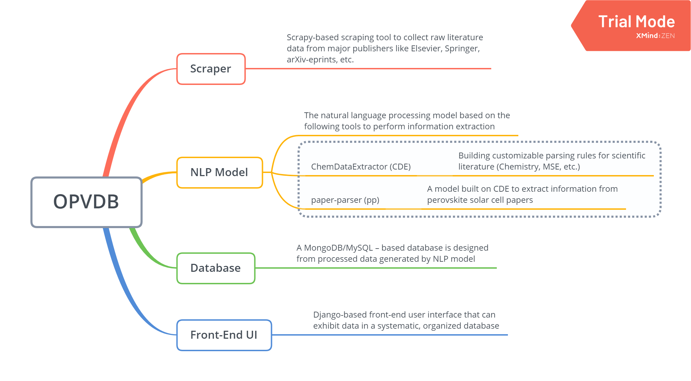

# DataExtractor

This is the second phase of OPVDB project.

This DataExtractor is built on ChemDataExtractor (CDE) version 1.3.0 by Matt Swain and paper-parser (pp) by Christian Chang and contributors.

The challenge faced by data mining in research and academia is the application of a pipeline in certain field of study and output a systematic database that can feed back and benefit the research.

Both CDE and pp provide excellent platforms of allowing users to customize items by themselves and perform data mining. pp stops at extracting information, and we believe we can perform the information extraction in more areas and build a organized and systematic database based on extracted information. Thus this project focuses on practical use of a data mining pipeline, including literature collection, data parsing, data exhibition and database creation.

## Description

The overall workflow of this project should follow this graph:


1. Data Collection

    Data Collection in this project focuses on scraping academic papers from major publishers, such as Elsvier, Springer, arXiv-eprints, etc. Using the API they provide to export sufficient number of literature to perform information extraction by using NLP model.

    [Scraper](https://github.com/Zhangjt9317/Scraper.git)

2. Information Extraction and Database

    We can focus on more fields of study, including peroskite solar cell, which is already done by pp, organic photovoltaic materials, which can be another topic to study, thermosetting resins, and thermal properties of materials. Basically any field that is experiment-heavy can benefit from this project and the database we created.

    [DataExtractor](https://github.com/Zhangjt9317/DataExtractor.git)

3. Exhibition

    After performing information extraction, the processed data can be further cleaned and organized, and then a Django-based platform can be built to exhibit researchers information of materials reported on literature. Given a good example, refer to this paper: [dye-sensitized solar cell database](https://www.ncbi.nlm.nih.gov/pubmed/29616364)

    [OPVDB](https://github.com/Zhangjt9317/OPVDB.git)


## Installation

In order to set up the necessary environment:

1. create an environment for `DataExtractor` with the help of [conda],
   ```
   conda env create -f environment.yaml
   ```
2. activate the new environment with
   ```
   conda activate DataExtractor
   ```
3. install `DataExtractor` with:
   ```
   python setup.py install # or `develop`
   ```

Optional and needed only once after `git clone`:

4. install several [pre-commit] git hooks with:
   ```
   pre-commit install
   ```
   and checkout the configuration under `.pre-commit-config.yaml`.
   The `-n, --no-verify` flag of `git commit` can be used to deactivate pre-commit hooks temporarily.

5. install [nbstripout] git hooks to remove the output cells of committed notebooks with:
   ```
   nbstripout --install --attributes notebooks/.gitattributes
   ```
   This is useful to avoid large diffs due to plots in your notebooks.
   A simple `nbstripout --uninstall` will revert these changes.


Then take a look into the `scripts` and `notebooks` folders.

## Dependency Management & Reproducibility

1. Always keep your abstract (unpinned) dependencies updated in `environment.yaml` and eventually
   in `setup.cfg` if you want to ship and install your package via `pip` later on.
2. Create concrete dependencies as `environment.lock.yaml` for the exact reproduction of your
   environment with:
   ```
   conda env export -n DataExtractor -f environment.lock.yaml
   ```
   For multi-OS development, consider using `--no-builds` during the export.
3. Update your current environment with respect to a new `environment.lock.yaml` using:
   ```
   conda env update -f environment.lock.yaml --prune
   ```
## Project Organization

```
├── AUTHORS.rst             <- List of developers and maintainers.
├── CHANGELOG.rst           <- Changelog to keep track of new features and fixes.
├── LICENSE.txt             <- License as chosen on the command-line.
├── README.md               <- The top-level README for developers.
├── configs                 <- Directory for configurations of model & application.
├── data
├── docs                    <- Directory for Sphinx documentation in rst or md.
├── environment.yaml        <- The conda environment file for reproducibility.
├── models                  <- Trained and serialized models, model predictions,
│                              or model summaries.
├── notebooks               <- Jupyter notebooks. Naming convention is a number (for
│                              ordering), the creator's initials and a description,
│                              e.g. `1.0-fw-initial-data-exploration`.
├── references              <- Data dictionaries, manuals, and all other materials.
├── reports                 <- Generated analysis as HTML, PDF, LaTeX, etc.
│   └── figures             <- Generated plots and figures for reports.
├── scripts                 <- Analysis and production scripts which import the
│                              actual PYTHON_PKG, e.g. train_model.
├── setup.cfg               <- Declarative configuration of your project.
├── setup.py                <- Make this project pip installable with `pip install -e`
│                              or `python setup.py develop`.
├── src
│   └── dataextractor       <- Actual Python package where the main functionality goes.
├── tests                   <- Unit tests which can be run with `py.test` or
│                              `python setup.py test`.
├── .coveragerc             <- Configuration for coverage reports of unit tests.
├── .isort.cfg              <- Configuration for git hook that sorts imports.
└── .pre-commit-config.yaml <- Configuration of pre-commit git hooks.
```

## Note

This project has been set up using PyScaffold 3.2.1. For details and usage
information on PyScaffold see https://pyscaffold.org/.

[conda]: https://docs.conda.io/
[pre-commit]: https://pre-commit.com/
[Jupyter]: https://jupyter.org/
[nbstripout]: https://github.com/kynan/nbstripout
[Google style]: http://google.github.io/styleguide/pyguide.html#38-comments-and-docstrings


# Contributors 
Jingtian Zhang
Edwin Jiang
Luna Huang
Fumio Ohuchi


# Acknowledgements

Great thanks to people who provide resources for this project and contributors who contribute to it. Details refer to the list of contributors in this publication: [iamthearticle]